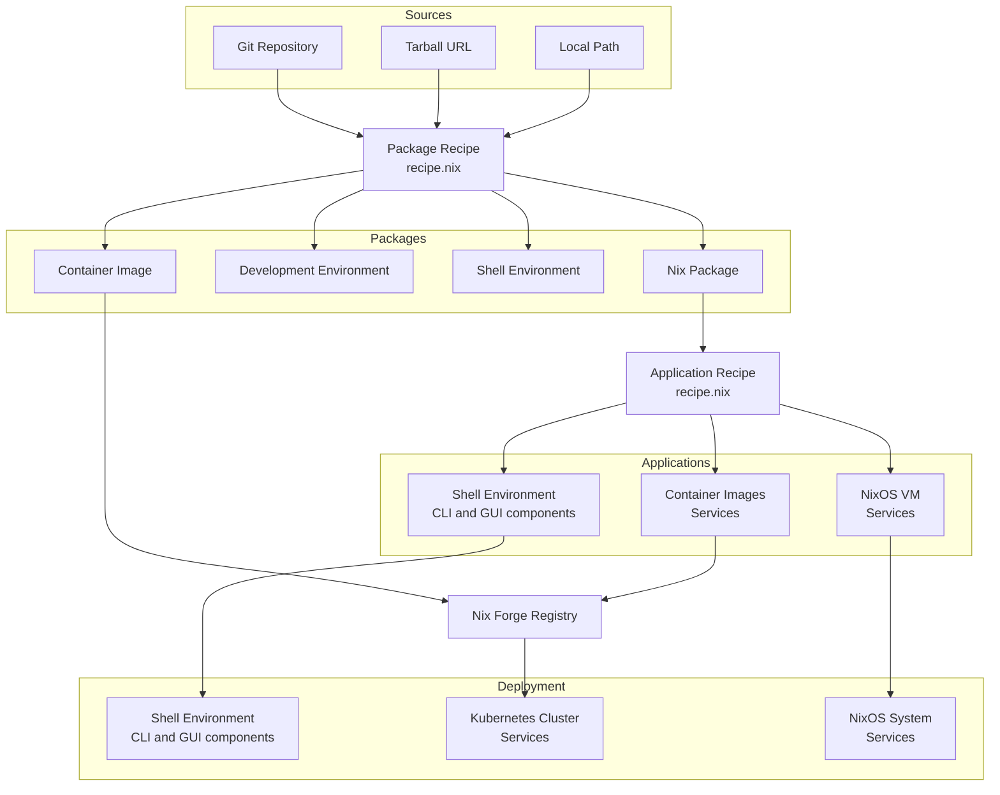

# Nix Forge

**WARNING: this sofware is currently in alpha state of development.**

Nix Forge is lowering the barrier and learning curve required for packaging,
distributing and software deployment with Nix, enforcing best practices and
unlocking the superpowers of Nix to the ordinary humans.


## Features

* Simple, type checked configuration recipes for **packages** and
  **mutli-component applications** using
  [module system](https://nix.dev/tutorials/module-system/index.html)

* [Web UI](https://imincik.github.io/nix-forge)

* [Built-in packaging wizard](https://imincik.github.io/nix-forge/options.html)

* [LLMs support](./AGENTS.md)

* Easy [self hosting](#self-hosting)

* [Container registry](https://github.com/imincik/nix-forge-registry)


### Conceptual diagram



## Self hosting

* Initiate new Nix Forge instance from template

```bash
nix flake init --template github:imincik/nix-forge#example
```

* Set `repositoryUrl` attribute in `flake.nix` to your repository

* Add all new files to git

* Start creating recipes  in `recipes` directory


## LLM agents

LLM agents, read [these instructions](./AGENTS.md) first.


## Commercial support

Need help with packaging software with [Nix](https://nixos.org/) or building
a NixOS system ? Get in touch with [me](https://github.com/imincik) to discuss
your project.
